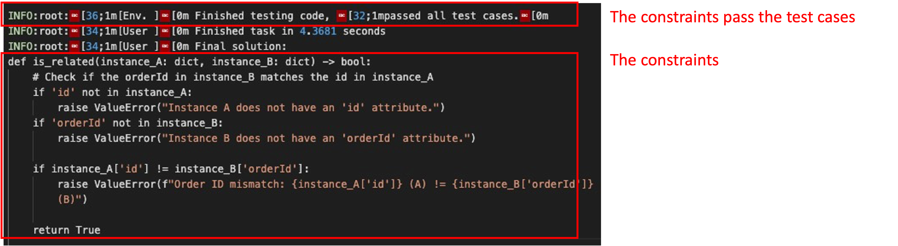

# Webnorm
Official repository for "Detecting and Explaining Anomalies Caused by Web Tamper Attacks via Building Consistency-based Normality".

<p align="center">

  • <a href="https://sites.google.com/view/webnorm">Visit our Website</a> •

  • <a href="https://zenodo.org/records/13753186">Visit our Code</a> •

</p>

## Introduction
Existing Log-based anomaly detection
- ❌ Cannot detect subtle change (often seen in tamper attacks)
- ❌ Cannot fully provide the explanation of the anomaly.

In our Webnorm, we build a consrtaint-based log anomaly detection framework:

- ✅ **Output tamper anomaly with explannation**: Compared to existing solutions that rely on deep-learning-based models and the similarity-based models, LLMs can further improve their comprehensive understanding, especially upon the logs' nuance and minor change.
- ✅ **Chain-of-thought credential-taking prediction**: Reasoning the constraints in a step-by-step way by looking at the class dedination and logs

## Framework


```Input```: a set of logs, ```Output```: Anomaly with explannations

- **Step 1: Log instrumentation and Seeds exection**
  - Input: Backend
  - Intermediate Output: Instrumented Backend
  - Output: Benign log dataset
  
- **Step 2: Construct the event graph**
  - Input: Backend, Frontend, Logs
  - Output: Event grpah indicating 3 relations (DB-sharing, Data transition, Trigger condidion).
  
- **Step 3: Constraint-learning**
  - Input: Backend, Logs, Event grpah
  - Output: Python function reflecting the constraints.

- **Step 4: Output Anomaly** 
  - Input: Logs in deployment phase
  - Output: Anomaly with explanation.

## Project structure

<pre>
├── Anomaly_detect.py  # Anomaly detection
├── consistency_prompt
│   ├── examples # Constraint-learning Examples
│   ├── gptchecker
│   │   ├── gpt.py
│   │   ├── __init__.py
│   │   ├── logger.py
│   │   ├── prompt.py # Constraint-learning prompt
│   │   └── tester.py # Constraint-learning verifycation
│   └── README.md
├── Event_graph
│   ├── API_logs_define.py
│   ├── backend_API.py
│   ├── code_database.py # Construct the database sharing
│   ├── dataflow_and_trigger.py # Construct the dataflow and trigger condition
│   ├── Event_graph.py 
│   └── trigger_code_parse.py
├── Log_Instrument
│   ├── config_templates.py
│   ├── deleteLogs.py  # Delete the original logs 
│   ├── Instrumentation.py # Instrument with AOP
├── README.md
└── setup.sh
</pre>

## Setup
- Step 1: Clone the Repository and **Build docker**. A new docker image will be created
```bash
    docker build -t webnorm .
    docker run -it webnorm /bin/bash
```
- Step 2: Register **OpenAI API Key**, [See Tutorial here](https://platform.openai.com/docs/quickstart). Paste the API key to 'TamperLogPrompt/consistency_prompt/.env'.

- Step 3 (optional):  Run Demo, our artifact provides demonstrations of important components of WebNorm to help users quickly understand. To run the demonstrations, cd to consistency_prompt/examples and execute python3 xxx.py. You can find a detailed description of each demonstration in  `consistency_prompt/examples/README.md`.

## Constraint-learning: Construct the Event graph and build constraints.
Run the following command to test the function of constructing dataflow and trigger constraints:

Note: The above commands will initiate the process of building
the dataflow, trigger relations and extract all constraints. It is worth
noting that the entire process involves extensive interaction with
OpenAI, which requires a certain amount of time and money. To
assist the users, we provide examples for the construction of
each event graph and constraint in the demo section. Additionally,
we encourage users to use their own OpenAPI key to obtain
results; if the key is set to null in the .env file, the artifact will use
pre-executed responses from GPT to show the results
```bash
  cd Event_graph

  # Dataflow constraints:
  python3 dataflow_and_trigger.py -dc=true

  #Flow constraints:
  python3 dataflow_and_trigger.py -tr=true

  #Commonsense constraints:
  python3 commonsense_class.py
  python3 commonsense_noclass.py
```
The constraints ought to be:


The generated constraints are stored in the json to detect the anomalies.

## Detect Anomaly: **Consistency Verification** using the constructed constraints
```bash
  python3 Anomaly_detect.py
```
The reported anomalies ought to be:


The anomalies and the explanation should be referred to dataset_label.csv to check whether it is a true positive.

## (Optional) Use other versions of GPT

You can change the GPT model you want to use in the ``LLM_model`` argument in [param_dict.yaml](param_dict.yaml), default is "gpt-3.5-turbo-16k".
Please check the [list of GPT models](https://platform.openai.com/docs/models) you can use.

If you have any issues running our code, you can raise a Github issue.
